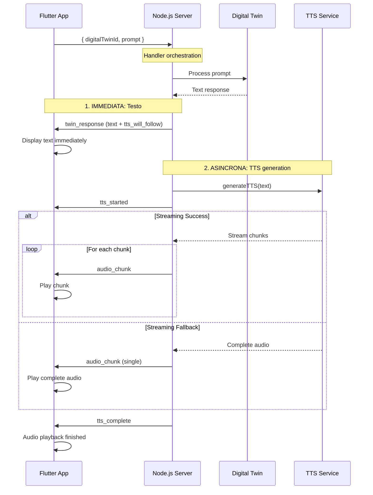

# Protocollo WebSocket per Digital Twin + TTS Streaming - Flutter App

## Panoramica

Questo documento definisce il protocollo di comunicazione WebSocket tra il server Digital Twin con TTS e l'app Flutter per streaming audio in tempo reale.

## Connessione WebSocket

### Endpoint
```
ws://localhost:3000/
```

## Formato Messaggi

Tutti i messaggi sono in formato **JSON** con la seguente struttura base:

```json
{
  "type": "message_type",
  "timestamp": "2025-11-03T15:30:00.000Z",
  "data": { /* contenuto specifico */ }
}
```

## Messaggi Client → Server (Flutter → Node.js)

### 1. Richiesta Digital Twin con TTS (Automatico)
```json
{
  "digitalTwinId": "warren-buffett",
  "digitalTwinName": "Warren Buffett", 
  "prompt": "Cosa pensi degli investimenti in tecnologia?"
}
```

**Nota:** Il TTS viene generato automaticamente per ogni risposta. Il server mantiene la cronologia delle conversazioni per ogni `digitalTwinId`.

##  Messaggi Server → Client (Node.js → Flutter)

### 1. Risposta Digital Twin (IMMEDIATA - Testo)
```json
{
  "type": "twin_response",
  "timestamp": "2025-11-03T15:30:00.000Z",
  "data": {
    "digitalTwinId": "warren-buffett",
    "digitalTwinName": "Warren Buffett",
    "text": "Bene, per quanto riguarda gli investimenti in tecnologia, devo dire che sono sempre stato cauto. Come dico spesso, 'investo solo in ciò che capisco'.",
    "session_id": "warren-buffett_1699012345678",
    "tts_will_follow": true
  }
}
```

### 2. TTS Iniziato (ASINCRONO - Dopo testo)
```json
{
  "type": "tts_started", 
  "timestamp": "2025-11-03T15:30:00.000Z",
  "data": {
    "session_id": "warren-buffett_1699012345678_abc123",
    "digitalTwinId": "warren-buffett",
    "text": "Bene, per quanto riguarda gli investimenti...",
    "voice": "a882153d-42fa-4f24-940e-f1c9f7853b12",
    "provider": "speechify",
    "format": "mp3",
    "estimated_duration": "12.37s"
  }
}
```

### 3. Audio Chunks (STREAMING o COMPLETO)

#### Caso A: Streaming Real-time (Multipli chunks)
```json
{
  "type": "audio_chunk",
  "timestamp": "2025-11-03T15:30:00.000Z", 
  "data": {
    "session_id": "warren-buffett_1699012345678_abc123",
    "chunk_index": 0,
    "audio_base64": "SUQzAwAAAAAJAAAAAAAAAP//4xA...",
    "total_chunks_expected": 15,
    "format": "mp3", 
    "is_final_chunk": false
  }
}
```

#### Caso B: Audio Completo (Singolo chunk - Fallback)
```json
{
  "type": "audio_chunk",
  "timestamp": "2025-11-03T15:30:00.000Z",
  "data": {
    "session_id": "warren-buffett_1699012345678_abc123", 
    "chunk_index": 0,
    "audio_base64": "SUQzAwAAAAAJAAAAAAAAAP//4xA...",
    "total_chunks_expected": 1,
    "format": "mp3",
    "is_final_chunk": true
  }
}
```

### 4. TTS Completato
```json
{
  "type": "tts_complete",
  "timestamp": "2025-11-03T15:30:00.000Z",
  "data": {
    "session_id": "warren-buffett_1699012345678_abc123",
    "digitalTwinId": "warren-buffett", 
    "total_chunks": 15,
    "total_audio_bytes": 156780,
    "total_duration": "12.37s",
    "audioUrl": "data:audio/mp3;base64,..." // Solo per fallback audio completo
  }
}
```

### 5. Errori
```json
{
  "type": "error",
  "timestamp": "2025-11-03T15:30:00.000Z",
  "data": {
    "error_code": "DIGITAL_TWIN_ERROR|TTS_ERROR",
    "digitalTwinId": "warren-buffett",
    "message": "Errore durante la generazione TTS: Voice not found",
    "stage": "twin_response|tts_synthesis"
  }
}
```

## 🔄 Flusso di Comunicazione Semplificato

### Scenario: Digital Twin + TTS Automatico



## 🎵 Gestione Flutter - Implementazione Aggiornata

### WebSocket Client Semplificato
```dart
class DigitalTwinClient {
  WebSocketChannel? _channel;
  final AudioPlayer _player = AudioPlayer();
  List<Uint8List> _audioChunks = [];
  
  // Callbacks
  Function(String text)? onTextReceived;
  Function()? onTTSStarted;
  Function(double progress)? onAudioChunk;
  Function()? onTTSComplete;
  
  void _handleMessage(Map<String, dynamic> message) {
    switch (message['type']) {
      case 'twin_response':
        final text = message['data']['text'] as String;
        onTextReceived?.call(text);
        _audioChunks.clear(); // Reset per nuovo audio
        break;
        
      case 'tts_started':
        onTTSStarted?.call();
        break;
        
      case 'audio_chunk':
        final data = message['data'];
        final base64Audio = data['audio_base64'] as String;
        final chunkIndex = data['chunk_index'] as int;
        final totalChunks = data['total_chunks_expected'] as int;
        final isFinal = data['is_final_chunk'] as bool;
        
        // Decodifica chunk
        final audioBytes = base64Decode(base64Audio);
        _audioChunks.add(audioBytes);
        
        // Progress callback
        final progress = (chunkIndex + 1) / totalChunks;
        onAudioChunk?.call(progress);
        
        // Se è l'ultimo chunk o chunk singolo, riproduci
        if (isFinal || totalChunks == 1) {
          _playCompletedAudio();
        }
        break;
        
      case 'tts_complete':
        onTTSComplete?.call();
        break;
    }
  }
  
  void _playCompletedAudio() async {
    if (_audioChunks.isEmpty) return;
    
    // Combina tutti i chunks
    final totalLength = _audioChunks.fold(0, (sum, chunk) => sum + chunk.length);
    final combinedAudio = Uint8List(totalLength);
    
    int offset = 0;
    for (final chunk in _audioChunks) {
      combinedAudio.setRange(offset, offset + chunk.length, chunk);
      offset += chunk.length;
    }
    
    // Riproduci audio combinato
    await _player.play(BytesSource(combinedAudio));
  }
  
  void sendMessage(String digitalTwinId, String digitalTwinName, String prompt) {
    final message = {
      'digitalTwinId': digitalTwinId,
      'digitalTwinName': digitalTwinName,
      'prompt': prompt,
    };
    
    _channel?.sink.add(json.encode(message));
  }
}
```

## Caratteristiche del Protocollo Aggiornato

### 1. **Semplificazione**
- **No configurazione TTS**: Generazione automatica
- **Meno messaggi**: Solo quelli essenziali
- **Gestione unified**: Streaming + completo stesso protocollo

### 2. **Robustezza**
- **Fallback automatico**: Streaming → Audio completo
- **Gestione errori**: Separata per LLM e TTS
- **Cronologia mantenuta**: History gestita server-side

### 3. **Performance**
- **Risposta immediata**: Testo in ~1-2 secondi
- **Parallelismo**: TTS in background
- **No file server**: Solo streaming in memoria

##  Modifiche Principali

### Rispetto alla versione precedente:
1. **Rimosso `tts_options`** dal client - tutto automatico
2. **Semplificato flusso audio** - gestisce streaming e completo uniformemente  
3. **Handler asincrono** - orchestrazione server-side
4. **No salvataggio file** - solo streaming puro
5. **Fallback integrato** - robustezza automatica

##  Caratteristiche Tecniche

### Server-side (Node.js)
- **Cronologia mantenuta**: History per ogni `digitalTwinId` in memoria per connessione
- **Fallback TTS**: Streaming → Audio completo se streaming fallisce  
- **Voice handling**: Supporta UUID voices e fallback a voci comuni
- **Error isolation**: Errori LLM e TTS gestiti separatamente
- **Session management**: Ogni risposta ha un `session_id` unico

### Client-side (Flutter) 
- **Decodifica corretta**: Base64 → `Uint8List` per ogni chunk
- **Combinazione binaria**: Buffer audio combinati, non stringhe
- **Riproduzione unificata**: Stesso flow per streaming e completo
- **Progress tracking**: Basato su `chunk_index/total_chunks_expected`

## Considerazioni Implementative

### Gestione Cronologia Conversazione
```javascript
// Server mantiene history per digitalTwinId
const clientSessions = new Map(); // digitalTwinId -> history[]
```

### Voice ID Configuration  
```env
# .env - Supporta sia nomi che UUID
TTS_AGENT_ID=henry                                    # Nome voce
TTS_AGENT_ID=a882153d-42fa-4f24-940e-f1c9f7853b12   # UUID voce
```

### Fallback Chain
```
1. Streaming TTS con voice configurata
2. Streaming TTS con voci alternative  
3. Audio completo con voice configurata
4. Audio completo con voci alternative
5. Errore TTS
```

---

**Il protocollo è completamente allineato con l'implementazione server attuale!**
